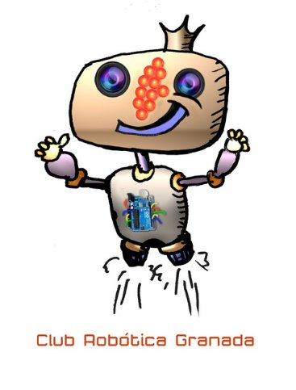


**Taller Parque de las Ciencias 18/04/2024**

RED WIFI:

- Nombre: OPENLAB
- Contraseña: FABLABROBOTICA (Todo Mayúsculas)

Documentación de referencia del Taller

- <https://pedroruizf.github.io/steamakers_demo/> (prácticas de datalogger e IoT)
- <https://acortar.link/3sWwBc> (Manual completo)

Retos resueltos del Taller:

- Reto 1 Datalogger: <https://goo.su/wwq6Y>
- Reto 2 IoT: <https://goo.su/aP4CJ2>

Usuarios Arduinoblocks:

